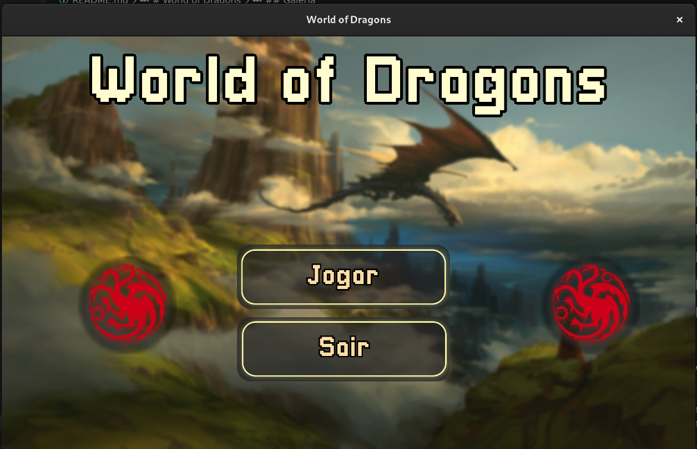
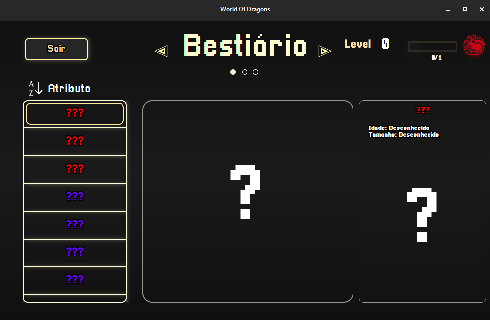

# World of Dragons

Jogo de batalha por turnos para desktop, escrito inteiramente em C com interface gráfica em GTK 3 e áudio em SDL2. O jogador escolhe um dragão, sobe de nível enfrentando adversários progressivamente mais fortes no coliseu e usa minijogos de reflexo para amplificar os próprios ataques.

<p align="center">
  
</p>

> Projeto de fã, sem fins comerciais, inspirado no universo de *As Crônicas de Gelo e Fogo*. Nomes de dragões e parte dos assets pertencem aos seus titulares. Veja [ASSETS.md](./ASSETS.md).

---

## O jogo em números

| | |
| --- | --- |
| Dragões jogáveis e adversários | 27, distribuídos igualmente entre fogo, gelo e vento |
| Ataques | 8, entre físicos e elementais |
| Efeitos de status | 5 debuffs com duração em turnos |
| Progressão | 100 níveis, com curva de experiência definida em arquivo |
| Minijogos | 2, integrados ao combate |

---

## Como se joga

Cada save começa com um dragão de nível baixo. No **coliseu**, o jogador enfrenta os 27 dragões do bestiário em ordem crescente de força, do nível 1 ao 100. Vencer rende experiência, que sobe o nível do jogador e gera pontos de treino para distribuir nos atributos do dragão.

O **combate** é por turnos. Cada ataque tem multiplicador de dano, precisão e tempo de recarga próprios, e ataques elementais podem aplicar efeitos que persistem por vários turnos: sangramento, queimadura, congelamento, medo e instabilidade. Esses efeitos se acumulam, e o jogo trata aplicações duplicadas do mesmo efeito.

Antes de certos ataques, um **minijogo** decide a força do golpe. No medidor, o jogador precisa parar um ponteiro em movimento na faixa certa. No desafio, disputa uma barra contra o adversário. O resultado altera diretamente o dano causado.

O **bestiário** reúne os 27 dragões com história, idade, tamanho e atributos, e permite ordenar a lista por diferentes critérios. Dragões são desbloqueados conforme o progresso no coliseu.

---

## Galeria

<table>
  <tr>
    <td></td>
    <td></td>
  </tr>
  <tr>
    <td align="center">Menu principal</td>
    <td align="center">Caverna</td>
  </tr>
  <tr>
    <td></td>
    <td></td>
  </tr>
  <tr>
    <td align="center">Coliseu</td>
    <td align="center">Bestiário</td>
  </tr>
  <tr>
    <td></td>
    <td></td>
  </tr>
  <tr>
    <td align="center">Minijogo do medidor</td>
    <td align="center">Minijogo do desafio</td>
  </tr>
  <tr>
    <td></td>
    <td></td>
  </tr>
  <tr>
    <td align="center">Vitória</td>
    <td align="center">Derrota</td>
  </tr>
</table>

---

## Destaques técnicos

**Persistência em arquivos binários.** Dragões, ataques e saves são gravados com `fwrite` diretamente a partir das structs, em registros de tamanho fixo. Isso permite calcular a quantidade de registros com `ftell` e `sizeof`, acessar um registro específico por deslocamento com `fseek` e remover registros reescrevendo o arquivo sem o item. Os dados do jogo (`files/beastsList.bin` e `files/attacksList.bin`) e os saves do jogador usam o mesmo mecanismo.

**Motor de animação sobre o loop do GTK.** O GTK não oferece animação de sprites pronta, então o jogo implementa a sua: cada animação é uma struct com widget, quadro atual, total de quadros e flag de repetição, avançada por callbacks de `g_timeout_add`. Sobre essa base existem animações de ataque, movimentação de widgets entre coordenadas, barras de vida que descem gradualmente, texto flutuante que desaparece e tremor de tela.

**Sistema de batalha como máquina de estados.** Um turno envolve jogador, adversário, animações, minijogo e aplicação de efeitos, e várias dessas etapas são assíncronas porque dependem de timeouts. O estado da batalha é coordenado por um conjunto de flags (`BattleFlags`) que indica quem já agiu, se o minijogo terminou, se o ataque está pronto e se a batalha acabou, garantindo que cada etapa só começa quando a anterior termina.

**Efeitos de status com duração.** Cada combatente mantém vetores de buffs e debuffs com tipo e turnos restantes, além de um vetor de recarga por habilidade. A cada turno, os efeitos ativos causam seu impacto, são decrementados e expiram, e cada um tem sua própria animação sobre o dragão afetado.

**Áudio contextual com SDL2_mixer.** Músicas e efeitos são carregados uma vez na inicialização em um repositório com 50 posições para cada tipo, e acessados por nome ou índice. A trilha muda conforme o contexto, com músicas diferentes para menu, bestiário e batalha, e efeitos podem ser agendados com atraso para sincronizar com as animações.

**Interface declarativa.** O layout é desenhado no Glade e carregado em tempo de execução com `GtkBuilder`, e o visual é definido em CSS do GTK. O código C cuida só do comportamento, e a interface pode ser alterada sem recompilar.

---

## Arquitetura

O código fica em `src/`, dividido por responsabilidade:

| Arquivo | Responsabilidade |
| --- | --- |
| `main.c` | Inicialização, integração com a interface e fluxo das telas |
| `battle_libs.c` | Turnos, cálculo de dano, aplicação e expiração de efeitos |
| `animations_libs.c` | Motor de animação por quadros e movimentação de widgets |
| `audio_libs.c` | Carregamento e reprodução de músicas e efeitos sonoros |
| `files_libs.c` | Leitura e escrita dos arquivos binários de dados e saves |
| `player_libs.c` | Nível, experiência, treino e atributos do jogador |
| `account.c` | Criação e validação de saves |
| `dlibs.h` | Structs compartilhadas e protótipos de todos os módulos |

---

## Estrutura do repositório

```text
world-of-dragons/
│
├── src/                  # código-fonte em C
├── assets/
│   ├── css/                  # estilo da interface
│   ├── ui_files/             # layout da interface (Glade)
│   ├── img_files/            # sprites, cenários e quadros de animação
│   ├── sounds/               # músicas e efeitos sonoros
│   ├── fonts/                # fontes
│   └── screenshots/          # capturas usadas neste README
├── files/                # dados do jogo: dragões, ataques e curva de níveis
├── dlls/                 # runtime do GTK e do SDL para distribuição no Windows
├── lib/                  # loaders de imagem do GTK (Windows)
└── share/                # temas e ícones do GTK (Windows)
```

Os saves do jogador ficam em `accounts/`, criada automaticamente no primeiro uso e fora do versionamento. As pastas `dlls/`, `lib/` e `share/` não são código do projeto: são o runtime do GTK empacotado para que o jogo rode no Windows sem exigir instalação de dependências.

---

## Executando

### Windows: instalador

Baixe o instalador na seção [Releases](../../releases), execute e siga os passos. O jogo não precisa de permissões de administrador.

### Obtendo o código

```bash
git clone https://github.com/Rebornned/world-of-dragons.git
cd world-of-dragons
```

### Compilando no Windows (MSYS2)

No terminal **MSYS2 MINGW64**, instale as dependências:

```bash
pacman -S mingw-w64-x86_64-gcc mingw-w64-x86_64-pkgconf mingw-w64-x86_64-gtk3 mingw-w64-x86_64-SDL2 mingw-w64-x86_64-SDL2_mixer
```

Compile de dentro da pasta `src/`:

```bash
cd src
gcc -o WorldOfDragons.exe main.c audio_libs.c animations_libs.c files_libs.c account.c player_libs.c battle_libs.c \
    -mwindows $(pkg-config --cflags --libs gtk+-3.0 glib-2.0 pango) -lSDL2 -lSDL2_mixer
./WorldOfDragons.exe
```

Sem a flag `-mwindows`, o jogo abre acompanhado de um terminal com as mensagens de depuração.

### Compilando no Linux

Em distribuições baseadas em Debian ou Ubuntu:

```bash
sudo apt install build-essential pkg-config libgtk-3-dev libsdl2-dev libsdl2-mixer-dev
```

Compile de dentro da pasta `src/`:

```bash
cd src
gcc -o WorldOfDragons main.c audio_libs.c animations_libs.c files_libs.c account.c player_libs.c battle_libs.c \
    $(pkg-config --cflags --libs gtk+-3.0) -lSDL2 -lSDL2_mixer -lm
./WorldOfDragons
```

O executável precisa rodar a partir de `src/`, porque os caminhos de assets, dados e saves são relativos a essa pasta.

---

## Status e limitações conhecidas

O projeto está concluído e não recebe novas atualizações. Ele foi desenvolvido enquanto eu aprendia C, e as limitações abaixo ficam registradas como parte da história dele, em vez de corrigidas.

- **`main.c` concentra boa parte da lógica.** A separação em módulos veio no meio do desenvolvimento, e o arquivo principal ainda reúne a integração com a interface e o fluxo de várias telas. Hoje eu estruturaria o projeto em módulos por tela desde o início.
- **O formato dos saves depende do layout das structs.** Como os registros são gravados byte a byte, alterar um campo de `Player` ou `Dragon` invalida os arquivos existentes. Um formato versionado resolveria isso.
- **Caminhos relativos ao diretório de execução.** O jogo precisa ser iniciado de dentro de `src/`. Resolver os caminhos a partir da localização do executável eliminaria essa restrição.

---

## Tecnologias

| Escopo | Ferramentas |
| --- | --- |
| Linguagem | C |
| Interface | GTK 3, Glade, CSS do GTK, Cairo |
| Áudio | SDL2, SDL2_mixer |
| Build | GCC, pkg-config, MSYS2 |
| Distribuição | Inno Setup |

---

## Licença

O código-fonte está sob a licença MIT, veja [LICENSE](./LICENSE). Os assets de imagem, som e fonte não estão cobertos por ela, veja [ASSETS.md](./ASSETS.md).
